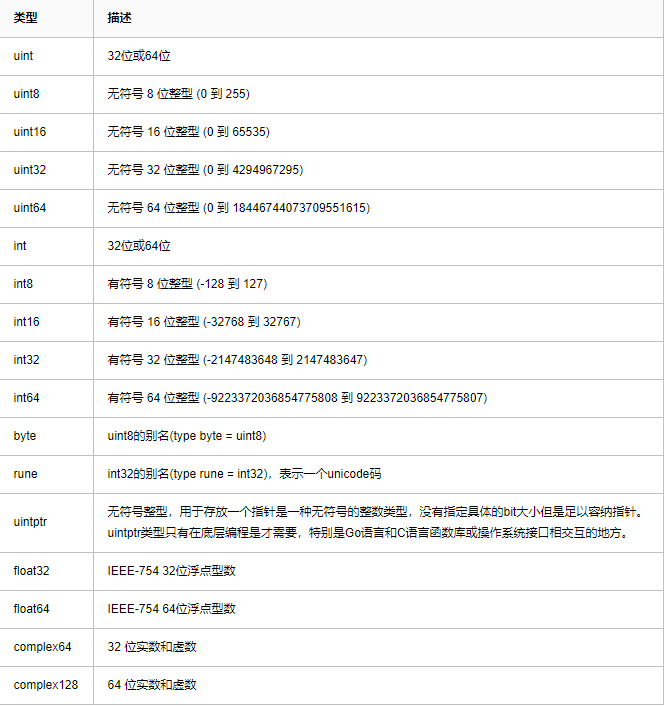

# Go 基础

## Go 语言数据类型




#### Go 语言变量

**关于数据溢出问题**

根据定义的数据类型的位数取值

```go
func main() {
    var a, b, num uint8
    a, b = 255, 255
    num = a * b
    /** 
     * 255*255 = 65025 转为二进制为 11111110 00000001
     * 取 uint8 00000001
     */
    println(num)
}
```

#### Go 语言常量

定义常量组时，如果不提供初始值，则表示将使用上行的表达式

```go
package main

import "fmt"

func main() {
    const (
        a = 1
        b
        c
    )
    fmt.Println(a) // 1
    fmt.Println(b) // 1
    fmt.Println(c) // 1
}
```

## 切片

**切片扩容**

* 第一种扩容策略-双倍扩容
1. 切片每次新增个数不超过原来的1倍，
1. 且每次增加数不超过1024个，
2. 且增加后总长度小于1024个，
3. 这种情况下扩容后为原来的2倍

* 第二种扩容策略-微扩容
1. 切片一次新增个数超过原来1倍
2. 但不超过1024个
3. 且增加后总长度小于1024个
4. 这种情况下扩容后比实际具有的总长度还要大一些。

* 第三种扩容策略-0.25倍增长
1. 原切片长度超过1024时，
2. 一次增加容量不是2倍而是0.25倍
3. 每次超过预定的都是0.25累乘

```go
package main
import "fmt"

func main() {
    var t = make([]int,0,10)
    var s = make([]int,0,10)

    fmt.Printf("addr:%p \t\tlen:%v content:%v\n",t,len(t),t)
    fmt.Printf("addr:%p \t\tlen:%v content:%v\n",s,len(s),s)

    t = append(s,1,2,3,4)

    fmt.Println(t)
    fmt.Println(s)

    fmt.Printf("addr:%p \t\tlen:%v content:%v\n",t,len(t),t)
    fmt.Printf("addr:%p \t\tlen:%v content:%v\n",s,len(s),s)
}
```