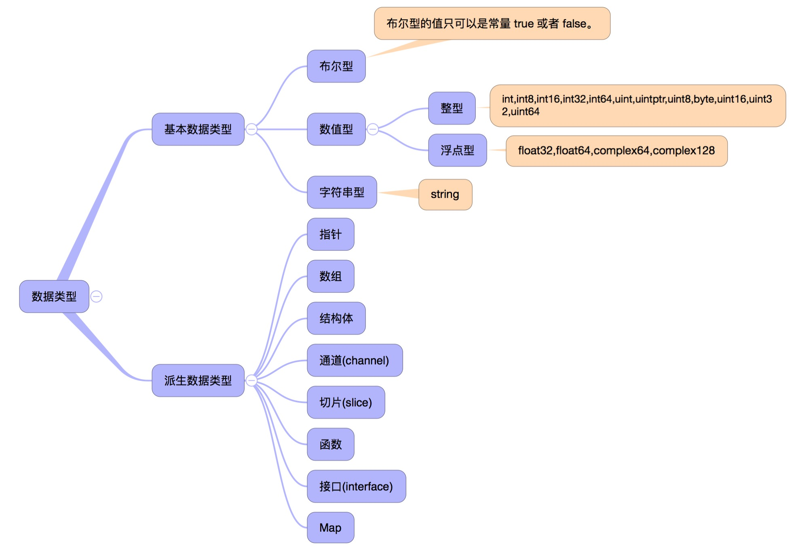

# Go 基础

## Go 语言数据类型




#### Go 语言变量

**关于数据溢出问题**

根据定义的数据类型的位数取值

```go
func main() {
    var a, b, num uint8
    a, b = 255, 255
    num = a * b
    /** 
     * 255*255 = 65025 转为二进制为 11111110 00000001
     * 取 uint8 00000001
     */
    println(num)
}
```

#### Go 语言常量

定义常量组时，如果不提供初始值，则表示将使用上行的表达式

```go
package main

import "fmt"

func main() {
    const (
        a = 1
        b
        c
    )
    fmt.Println(a) // 1
    fmt.Println(b) // 1
    fmt.Println(c) // 1
}
```