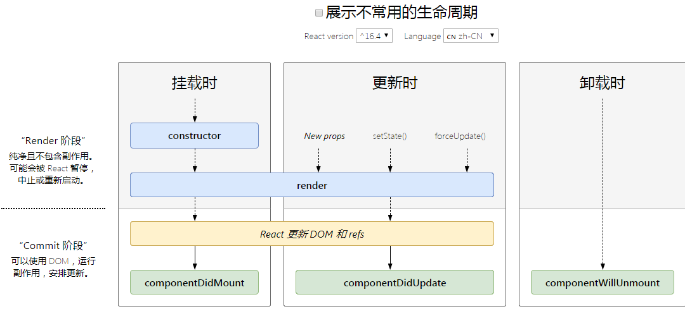
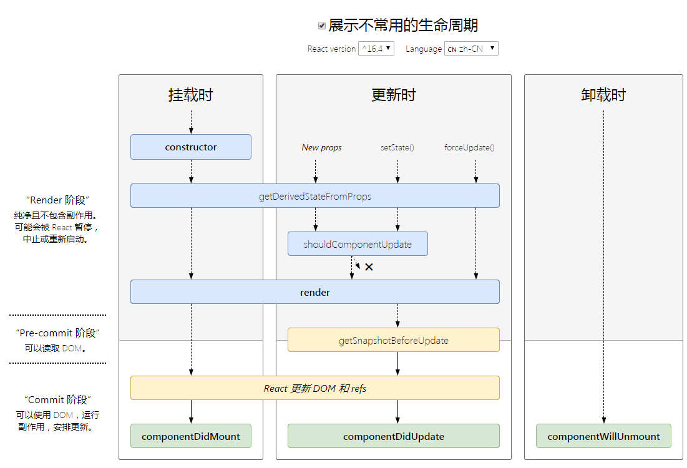

# React 基础

### JSX

- 表达式 `{}`
- 属性名：小驼峰
- 防止注入攻击，React DOM 在渲染所有输入内容之前，默认会进行转义。可以安全的在 JSX 中插入用户输入内容

### 组件 & Props

独立可复用的代码片段，类似于 JavaScript 函数，接受任意的入参（props），返回用于描述页面展示内容的 React 元素

**函数组件与 class 组件**

**props 的只读性**

- 所有 React 组件都必须像纯函数一样保护他们的 props 不被更改
- 在不违反上述规则的情况下，state 允许 React 组件随用户操作、网络响应或者其他变化而动态更改输出内容

### State & 生命周期

state 是私有的，并且完全受控于当前组件

每次组件更新时 `render` 方法都会被调用，但只要在相同的 DOM 节点中渲染组件，就仅有一个组件的 class 实例被创建使用

Class 组件应该始终使用 `props` 参数来调用父类的构造函数
```js
constructor(props) {
  super(props);
  this.state = {
    // 定义变量
  };
}
```

使用 `this.setState()` 来更新组件的 `state`

**生命周期方法**

`componentDidMount()` 方法会在组件已经被渲染到 DOM 中后运行，所以最好在这么设置计时器

在 `componentWillUnmount()` 方法中清除计时器

##### 正确使用 State

* 不要直接修改 State

  构造函数是唯一可以给 `this.state` 赋值的地方

  修改 `state` 使用 `setState()`

* State 的更新可能是异步的

  出于性能考虑，React 可能会把多个 `setState()` 调用合并成一个调用

  若要依赖 `this.state` 和 `this.props` 的值来更新下一个状态，可以让 `setState()` 接收一个函数，函数的第一个参数为上一个 state，第二个参数为此次更新被应用时的 props

  ```js
  this.setState((state, props) => ({
    counter: state.counter + props.increment
  }));
  ```

  ```js
  this.setState((state) => ({
    list: [...state.list, state.inputValue],
    inputValue: ''
  }), () => {
    // 回调函数
    // state 更新之后执行
    // 操作页面 DOM
  })
  ```
  建议使用 `componentDidUpdate()` 代替 `setState()` 的回调函数法
  
* State 的更新会被合并
  
  当你调用 `setState()` 的时候，React 会把你提供的对象合并到当前的 state

### 事件处理

* React 事件的命名采用小驼峰式（camelCase），而不是纯小写
* 使用 JSX 语法时你需要传入一个函数作为事件处理函数，而不是一个字符串

绑定 `this` 指向，推荐写法统一放在 `construction` 中（节约性能）
```js
class TodoList extends Component {
  constructor(props) {
    super(props);
    this.state = {
      isToggleOn: true
    };

    this.handleClick = this.handleClick.bind(this);
  }

  handleClick() {
    this.setState(state => ({
      isToggleOn: !state.isToggleOn
    }));
  }

  render() {
    return (
      <div onClick={this.handleClick}>
        {this.state.isToggleOn ? 'ON' : 'OFF'}
      </div>
    )
  }
}
```

### 条件渲染

`与运算符 &&` `三目运算符`

阻止组件渲染：`return null`，组件不进行渲染

### 表单

**受控组件**

```js
class NameForm extends React.Component {
  constructor(props) {
    super(props);
    this.state = {value: ''};

    this.handleChange = this.handleChange.bind(this);
    this.handleSubmit = this.handleSubmit.bind(this);
  }

  handleChange(event) {
    this.setState({value: event.target.value});
  }

  handleSubmit(event) {
    alert('提交的名字: ' + this.state.value);
    event.preventDefault();
  }

  render() {
    return (
      <form onSubmit={this.handleSubmit}>
        <label>
          名字:
          <input type="text" value={this.state.value} onChange={this.handleChange} />
        </label>
        <input type="submit" value="提交" />
      </form>
    );
  }
}
```

`<input type="text">`，`<textarea>` 和 `<select>` 接受 `value` 属性，使用它来实现受控组件

你可以将数组传递到 `value` 属性中，以支持在 `select` 标签中选择多个选项：
```js
<select multiple={true} value={['B', 'C']}>
```

在受控组件上指定 `value` 的 `prop` 可以防止用户更改输入。如果指定了 `value`，但输入仍可编辑，则可能是意外地将 `value` 设置为 `undefined` 或 `null`

**非受控组件**

在一个受控组件中，表单数据是由 React 组件来管理的。另一种替代方案是使用非受控组件，这时表单数据将交由 DOM 节点来处理。

要编写一个非受控组件，而不是为每个状态更新都编写数据处理函数，你可以 使用 `ref` 来从 DOM 节点中获取表单数据

```js
class NameForm extends React.Component {
  constructor(props) {
    super(props);
    this.handleSubmit = this.handleSubmit.bind(this);
    this.input = React.createRef();
  }

  handleSubmit(event) {
    alert('A name was submitted: ' + this.input.current.value);
    event.preventDefault();
  }

  render() {
    return (
      <form onSubmit={this.handleSubmit}>
        <label>
          Name:
          <input type="text" ref={this.input} />
        </label>
        <input type="submit" value="Submit" />
      </form>
    );
  }
}
```

在非受控组件中，给组件赋初始值：`<input type="text">` 支持 `defaultValue`；`<input type="checkbox">` 和 `<input type="radio">` 支持 `defaultChecked`；`<select>` 和 `<textarea>` 支持 `defaultValue`

**常用受控和不受控组件使用场景**

|特征|不受控|受控|
|-|-|-|
|一次性检索|√|√|
|提交时验证|√|√|
|即时验证|×|√|
|有条件的禁用提交按钮|×|√|
|强制格式化输入|×|√|
|一个变量多个输入|×|√|
|动态输入|×|√|

### tips

- 单向数据流：数据的流向通过 `props` 由外层组件向内层组件进行传递
- 函数式编程：更容易实现前端自动化测试

`<Framment></Framment>` 占位符组件

`<input dangerouslySetInnerHTML={{__html: item}}>` 对输入的 html 标签不进行转义

### React 哲学

##### 将设计好的 UI 划分为组件层级

##### 构建静态版本

静态版本不应使用 state

自上而下构建应用（简单应用） 自下而上构建组件

##### 确定 state 的最小（且完整）表示

检查数据是否属于 state：
- 该数据是否是由父组件通过 props 传递而来的？如果是，它应该不是 state
- 该数据是否随时间的推移而保持不变？如果是，那它应该也不是 state
- 你能否根据其他 state 或 props 计算出该数据的值？如果是，那它也不是 state

#### 确定 state 放置的位置

确定哪个组件能够改变这些 state，或者说拥有这些 state

对于应用中的每一个 state：
- 找到根据这个 state 进行渲染的所有组件
- 找到他们的共同所有者（common owner）组件（在组件层级上高于所有需要该 state 的组件）
- 该共同所有者组件或者比它层级更高的组件应该拥有该 state
- 如果你找不到一个合适的位置来存放该 state，就可以直接创建一个新的组件来存放该 state，并将这一新组件置于高于共同所有者组件层级的位置

#### 添加反向数据流

低层级的组件更新高层级组件中的 state

### 组件的生命周期

某一时刻被组件自动调用的函数



