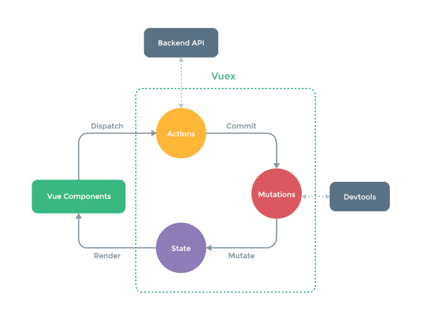

# Vue基础

### Vue实例

**生命周期**


### 计算属性和侦听器

#### 计算属性

`computed` 数据联动

计算属性是基于它们的响应式依赖进行缓存的，只在相关响应式依赖发生改变时才会重新求值

相比之下，每当触发重新渲染时，调用方法 `method` 将**总会**再次执行函数 

#### 侦听器

`watch` 异步场景

当需要在数据变化时执行异步或开销较大的操作时，使用侦听器

### Class与Style绑定

`:class=""`

`:style=""`

将 `v-bind` 用于 `class` 时 `style`，表达式结果的类型除了字符串外，还可以是对象或数组

### 条件渲染

`v-if` 销毁和重建

`v-show` 基于CSS进行切换

`v-if` 有更高的切换开销，如果在运行时条件很少改变，使用 `v-if`

`v-show` 有更高的初始渲染开销，如果需要非常频繁地切换，使用 `v-show`

### 列表渲染

`v-for`

列表循环需要加 `:key="唯一标识"`, 高效的更新虚拟DOM

组件上总是必须用 `key` 配合 `v-for`，以便维护内部组件及其子树的状态

永远不要把 `v-if` 和 `v-for` 同时用在同一个元素上

### v-on

`.stop` 调用 `event.stopPropagation()`

`.prevent` 调用 `event.preventDefault()`

`.native` 监听组件根元素的原生事件

### vue-cli

创建一个项目 **3.x版本**

```
vue create app-name
```

使用图形化界面
```
vue ui
```

**2.x版本**

```
vue init webpack app-name
```

### 组件化

**组件化**
* 独立的
* 可复用的
* 整体化的

**为什么要组件化**
* 实现功能模块的复用
* 高执行效率
* 开发单页面复杂应用

#### 组件间的数据传递

##### props

```js
props: {
  prop: {
    type: Object,  // 检测类型
    default: any,  // 指定默认值
    required: true,
    validator: Function
  }
}
```

##### vm.$emit

子组件像父组件传值

```js
vm.$emit(eventName, [...arg]);
```

### 过渡&动画

#### 过渡的类名


`v-enter-active` 和 `v-leave-active` 可以控制进入/离开过渡的不同的缓和曲线

### Vue Router

路由管理器

**active-class**

当 `<router-link>` 对应的路由匹配成功，将自动设置 `class` 属性值 `router-link-active` 可通过路由的构造选项 `linkActiveClass` 来全局配置

**tag**

默认值 `"a"`， 用于渲染 `<router-link>` 的标签类型，例如 `<li>` --> `tag="li"`

**redirect**

重定向，通过 `routes` 配置来完成

```js
redirect: '/a'
```
```js
// 命名路由
redirect: {name: 'foo'}
```
```js
redirect: to => {
  // 方法接收 目标路由 作为参数
  // return 重定向的 字符串路径/路径对象
}
```

#### HTTP

`vue-resource` 

```js
created () {
  this.$http.get('url').then((data) => console.log(data))
}
```

### Vuex

状态管理库



* `state` 驱动数据的数据源
* `mutation` 同步函数
* `action` 异步操作

Vuex 的状态存储是响应式的。当 Vue 组件从 store 中读取状态的时候，若 store 中的状态发生变化，那么相应的组件也会相应地得到高效更新

你不能直接改变 store 中的状态。改变 store 中的状态的唯一途径就是显式地**提交 (commit) mutation**。这样使得我们可以方便地跟踪每一个状态的变化，从而让我们能够实现一些工具帮助我们更好地了解我们的应用

**vuex 规则**

1. 应用层级的状态应该集中到单个 store 对象中。
2. 提交 mutation 是更改状态的唯一方法，并且这个过程是同步的。
3. 异步逻辑都应该封装到 action 里面。
